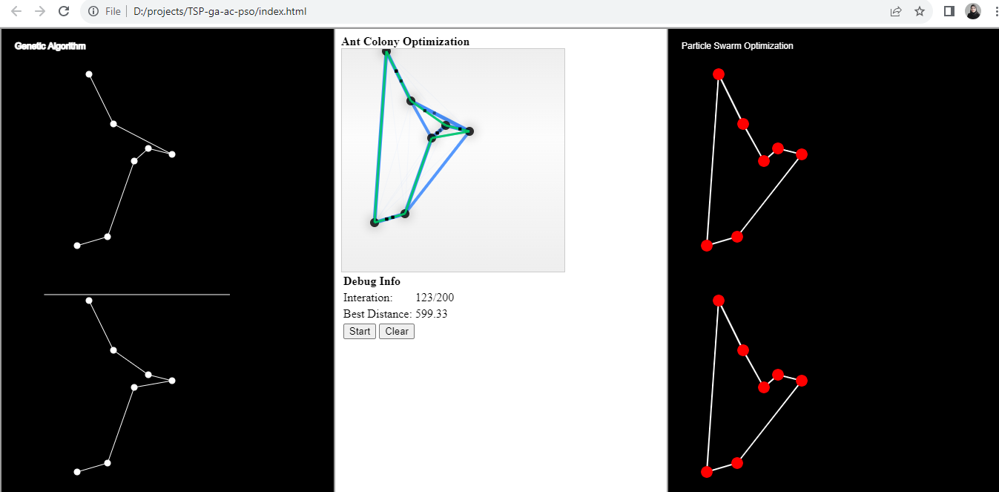

# Traveling Salesman Problem Solver Web Application

This web application solves the Traveling Salesman Problem (TSP) using three evolutionary algorithms: Genetic Algorithm, Ant Colony Optimization, and Particle Swarm Optimization (PSO). It is implemented in HTML, JavaScript (it uses [p5.js](https://p5js.org/) library).

## How to Run

1. Clone this repository to your local machine:
```console
git clone https://github.com/your-username/tsp-solver-web-app.git
```

2. Navigate to the project directory:
```console
cd tsp-solver-web-app
```

3. Open `index.html` in your web browser.

4. Upon running the application, a prompt will appear asking you to enter the number of cities for the TSP problem.

5. After entering the number of cities, the application will display the solutions obtained using Genetic Algorithm, Ant Colony Optimization, and Particle Swarm Optimization in three separate columns.

## Screenshots


## License

This project is licensed under the MIT License - see the [LICENSE](LICENSE) file for details.


